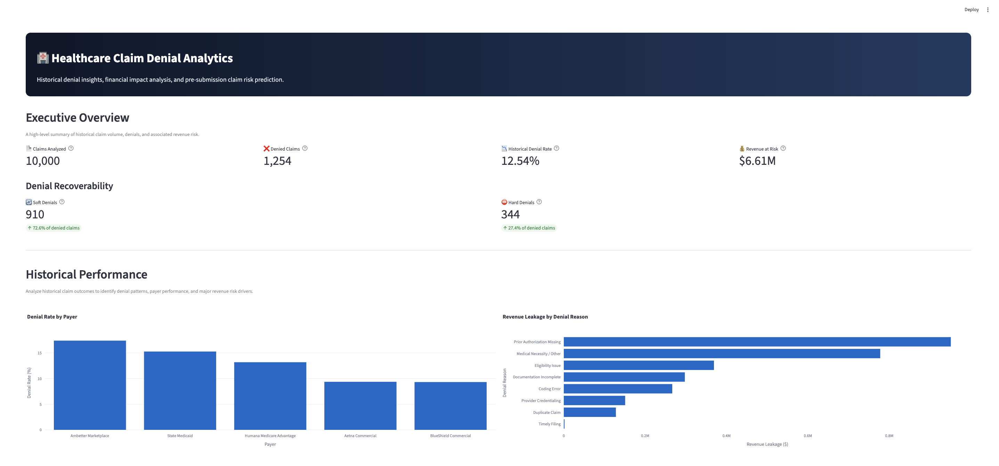
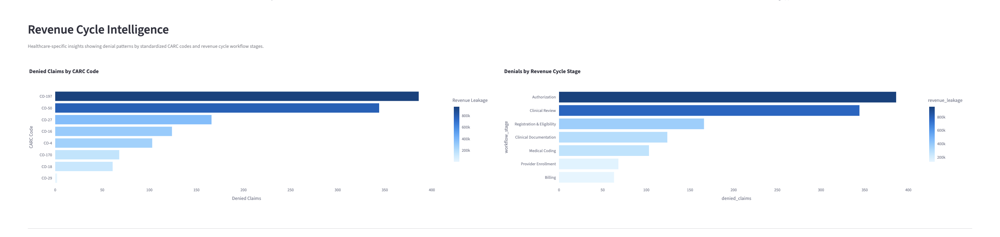
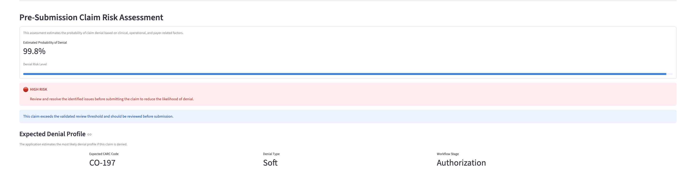
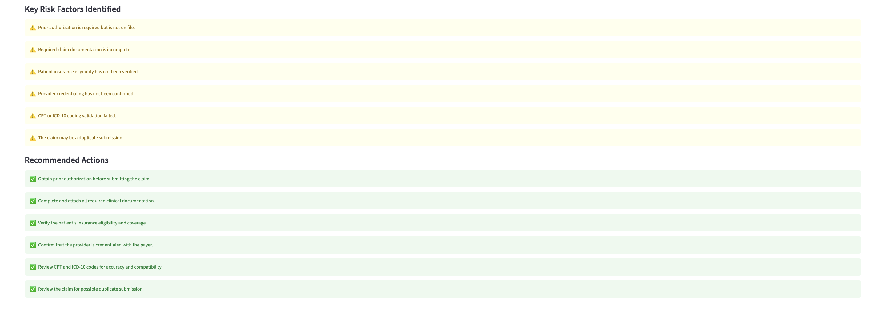

🏥 Healthcare Claim Denial Analytics

An end-to-end Business Analytics solution that combines data engineering, machine learning, and interactive visualization to identify high-risk healthcare claims before submission.

## 🚀 Live Demo

Explore the interactive dashboard here:

**https://healthcare-claim-denial-analytics.streamlit.app**

📌 Project Overview:

Healthcare providers lose millions of dollars annually due to denied insurance claims caused by incomplete documentation, coding errors, eligibility issues, and authorization failures.

This project demonstrates how predictive analytics can help revenue cycle teams identify potentially denied claims before submission, allowing operational teams to reduce reimbursement delays and improve financial performance.

The solution combines:

- Historical claim analytics
- Interactive business dashboards
- Machine learning-based denial prediction
- Explainable risk factors
- Actionable operational recommendations

## ⭐ Repository Highlights

- End-to-end Business Analytics project
- Synthetic healthcare claims dataset (10,000+ claims)
- SQLite data warehouse
- Interactive Streamlit dashboard
- Plotly executive visualizations
- Machine Learning prediction pipeline
- Logistic Regression with threshold optimization
- Explainable operational risk factors
- Business-focused recommendations

🎯 Business Problem:

Insurance claim denials create significant financial and operational challenges for healthcare organizations.

Common denial causes include:

Missing prior authorization
Incomplete documentation
Insurance eligibility issues
Provider credentialing problems
Coding errors
Duplicate claims

Traditional review processes rely heavily on manual validation, making it difficult to proactively identify high-risk claims.

💡 Solution:

The application provides two complementary capabilities:

Historical Analytics
Executive KPI dashboard
Denial rate by payer
Revenue at risk
Denial reason analysis
Predictive Analytics

Users enter claim information before submission.

The machine learning model estimates:

Probability of denial
Risk category
Key operational risk factors
Recommended actions

This enables healthcare organizations to intervene before claim submission instead of after denial.

🏗 Solution Architecture:
Healthcare Claims Dataset
          │
          ▼
Data Cleaning & Feature Engineering
          │
          ▼
SQLite Database
          │
          ▼
Scikit-Learn Pipeline
(ColumnTransformer +
OneHotEncoder +
StandardScaler +
Logistic Regression)
          │
          ▼
Probability Prediction
          │
          ▼
Streamlit Dashboard
          │
          ▼
Operational Recommendations

🚀 Features:
Executive Dashboard
Total claims analyzed
Historical denial rate
Revenue at risk
Denied claims
Historical Analytics
Denial Rate by Payer
Revenue Leakage by Denial Reason
Predictive Analytics
Estimated probability of denial
Risk categorization
Key risk factors
Recommended actions

## 💼 Business Analytics Skills Demonstrated

- Business Problem Framing
- Revenue Cycle Analytics
- Data Cleaning & Feature Engineering
- SQL Database Design
- Exploratory Data Analysis (EDA)
- Predictive Analytics
- Machine Learning
- Dashboard Development
- Business Storytelling
- Operational Decision Support

🛠 Technology Stack:
| Category | Technologies |
|----------|--------------|
| Language | Python |
| Database | SQLite |
| Data Processing | Pandas, NumPy |
| Visualization | Plotly, Streamlit |
| Machine Learning | Scikit-learn |
| Model | Logistic Regression |
| Preprocessing | ColumnTransformer, OneHotEncoder, StandardScaler |
| Model Persistence | Joblib |

🤖 Machine Learning Pipeline:

The prediction model was implemented using a Scikit-learn Pipeline to ensure consistent preprocessing during both training and inference.

The pipeline includes:

One-hot encoding for categorical variables
Feature scaling for numerical variables
Logistic Regression classifier
Threshold optimization for business use

This approach eliminates training-serving inconsistencies and simplifies deployment.

📊 Model Performance:
| Metric | Value |
|--------|------:|
| Accuracy | **87.7%** |
| Precision | **53.97%** |
| Recall (0.20 threshold) | **55.8%** |
| Best F1 Score | **0.432** |
| ROC-AUC | **0.7817** |

Because denied claims represent a smaller proportion of the dataset, accuracy alone does not fully reflect model performance. Greater emphasis was placed on ROC-AUC, precision, recall, and threshold optimization to evaluate how effectively the model identifies claims that may require pre-submission review. The decision threshold was adjusted from the default 0.50 to 0.20 to improve recall while maintaining reasonable precision for a business screening workflow.

## 📌 Business Questions Answered

This project helps healthcare organizations answer questions such as:

- Which payers generate the highest denial rates?
- Which denial reasons create the greatest revenue leakage?
- Which workflow stages contribute most to claim denials?
- Which claims require manual review before submission?
- What operational actions reduce denial risk?

## 🖥 Dashboard Preview

### Executive Overview

The Executive Overview summarizes overall claim volume, denial rate, revenue at risk, and denial recoverability metrics, providing stakeholders with a high-level operational snapshot.

---

### Revenue Cycle Intelligence

Interactive visualizations highlight denial trends across CARC codes and revenue cycle workflow stages, helping identify operational bottlenecks responsible for claim denials.

---

### Claim Risk Prediction

Users can evaluate an individual claim before submission. The application predicts denial probability, estimates the expected denial profile, and highlights operational risk factors requiring attention.

---

### Recommended Actions

Based on detected risks, the system generates actionable recommendations to reduce denial likelihood before claim submission, supporting proactive revenue cycle management.

## 📂 Repository Organization

| Folder | Purpose |
|---------|----------|
| dashboard | Streamlit application |
| data | Synthetic dataset and SQLite database |
| models | Trained machine learning model |
| notebooks | EDA, feature engineering and modeling |
| src | Data generation and business logic |
| screenshots | Dashboard screenshots used in README |

📂 Project Structure:
healthcare-claim-denial-analytics/
│
├── dashboard/
│   └── app.py
│
├── data/
│   ├── healthcare_claims.csv
│   ├── healthcare_claims.db
│   └── data_dictionary.csv
│
├── models/
│   └── claim_denial_pipeline.pkl
│
├── notebooks/
│   ├── 01_EDA.ipynb
│   ├── 02_Feature_Engineering.ipynb
│   └── 03_Model_Building.ipynb
│
├── src/
│   ├── generate_data.py
│   ├── recommendation_engine.py
│   └── setup_database.py
│
└── README.md

⚙ Installation:
git clone https://github.com/Simrithichoudhary/healthcare-claim-denial-analytics.git

cd healthcare-claim-denial-analytics

pip install -r requirements.txt

streamlit run dashboard/app.py

## 📈 Business Value

This solution demonstrates how predictive analytics can support healthcare revenue cycle management by enabling organizations to:

- Identify high-risk claims before submission
- Reduce preventable insurance claim denials
- Prioritize claims requiring manual review
- Improve reimbursement turnaround times
- Minimize revenue leakage through proactive intervention
- Support data-driven decision-making with interactive dashboards
- Enhance operational efficiency across the revenue cycle

⚠ Limitations:
The project uses a synthetic healthcare claims dataset for demonstration purposes.
Performance may differ on real-world payer data.
Logistic Regression was selected for interpretability; more advanced models could improve predictive performance.
Periodic retraining would be required to adapt to evolving payer rules and coding practices.

## 🗺️ Project Roadmap

Future improvements that could enhance the solution include:

- Compare Logistic Regression with XGBoost and LightGBM models
- Integrate SHAP for model explainability and feature importance visualization
- Deploy the application on Streamlit Community Cloud or Azure App Service
- Develop REST APIs for real-time claim scoring
- Add user authentication and role-based access control
- Support historical claim tracking and trend monitoring
- Integrate with real-world healthcare claims datasets for production use

## 📬 Contact

**Simrithi Choudhary**

MS in Business Analytics  
Iowa State University

- GitHub: https://github.com/Simrithichoudhary
- LinkedIn: https://www.linkedin.com/in/simrithi-choudhary-b0b2011a4/

If you have feedback, suggestions, or would like to discuss healthcare analytics, business analytics, or data science opportunities, feel free to connect with me on LinkedIn.

